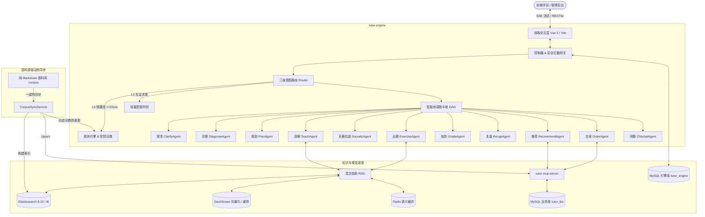

<div align="center">

# 🎓 智途 AI (Zhitu-AI)
### 面向成人职业教育的工业级多智能体协同导学系统
**Multi-Agent Collaborative AI Tutor System for Professional Education**

[](LICENSE)
[](https://spring.io/projects/spring-boot)
[](https://spring.io/projects/spring-ai)
[](https://vuejs.org/)
[](https://www.elastic.co/)
[](docs/test-report.md)

[English](./README_EN.md) · [简体中文](./README.md) · [测试报告](./docs/test-report.md) · [快速上手](#-5-分钟快速上手-quick-start) · [系统架构](#-系统架构全景) · [核心特性](#-核心工程特性)

</div>

---

## 🌟 项目简介 (Overview)

**智途 AI (Zhitu-AI)** 是一套面向计算机与技术转码学员的**工业级多智能体 AI 助教与教学导学系统**。
与市面上常见的大模型“单 Agent 提示词套壳”不同，智途 AI 采用**编排中枢 + 11 个专业业务智能体**的协同拓扑，真正实现了**“测评摸底 $\rightarrow$ 定制规划 $\rightarrow$ 启发导学 $\rightarrow$ 密封组卷 $\rightarrow$ 智能批改 $\rightarrow$ 全局复盘”**的全业务闭环。

系统创新性地实现了**“语料源驱动的零代码学科扩展机制”**——添加一门新学科无需修改任何一行 Java 或前端代码，仅需放置纯 Markdown 语料，系统即可自动热入库并激活推荐、RAG 教学、双轨出题与预下单全功能。

---

## 🚀 核心工程特性 (Key Features)

### 1. 🤖 编排中枢与 11 智能体拓扑
- **三级意图路由网络**：
  - **L0 规则快路径**：强特征零歧义请求（如“出3道多线程选择题”）免 LLM 极速短路，时延 $\le 25\text{ms}$；
  - **L2 轻量模型决策**：综合研判开放意图，支持跨轮槽位继承与受控词典强约束（意图评测 200 题脚本与数据集见 `docs/test-report.md`）；
  - **歧义否决机制**：设置解题探讨否决词，防止答题探讨被误判为重新出题。
- **单轮单次 LLM 联合决策**：单次调用联合输出意图、七维槽位与编排计划，节省 60% 冗余网络耗时与 Token 消耗；
- **状态机与 DAG 并行调度**：严控教学状态流转，引入 Critic 质检机制防止大模型幻觉。

### 2. ⚡ 语料源驱动与零代码扩展 (Zero-Code Extensibility)
- **纯 Markdown 热入库**：课程体系与私有题库完全由 Markdown 语料定义；
- **动态别名受控词典**：Frontmatter 声明的别名自动同步入库，`SkillDictionary` 结合并发内存哈希实现**无感热加载**，同义词智能归一；
- **全链路自适应**：新语料放入后点击一键同步，新学科的“推荐、RAG授课、出题组卷、电商下单、专属复盘”5 大环节即刻跑通，0 代码侵入。

### 3. 💡 苏格拉底导学与教学防作弊
- **启发式交互答疑**：肯定学员工程直觉，采用反问启发学员自行发现单线程与并发、版本迭代差异（如经典的“七段八桶”口诀）；
- **答案密封下发机制**：下发答题卡时在报文级**绝对剥离 `answer` 与 `explanation`**，答案键仅存服务端随卷关联，作答后由批改智能体判分揭晓，杜绝前端抓包作弊；
- **多轮全局动态复盘**：会话收尾时提炼认知主线思维导图与三大盲区钉牢，输出针对性学习路线图，首字延迟（TTFT）压至亚秒级（$903\text{ms}$）。

### 4. 🔍 工业级混合 RAG 检索管线
- **四阶检索流水线**：`全文 BM25 + 1024 维 Dense 密集向量 + RRF 倒数排名融合 + Cross-Encoder (GTE-Rerank) 语义重排`，Recall@5 达到 **$96\%$**；
- **多格式文档解析**：支持 Web 端拖拽解析 Word (`.docx`)、PDF (`.pdf`) 与 Markdown 结构化章节切片并注入面包屑；
- **知识冲突与相似预警**：前置冲突检测算法，上传相左条款时弹出 `conflictAlert` 红色预警；
- **Redis 语义缓存**：高频相似问题命中缓存秒级返回（$\le 80\text{ms}$）。

### 5. 🛡️ 工业级安全防御与全链路容灾
- **对抗样本 100% 拦截**：40 组安全攻防样本（Prompt 越狱、DAN 模式、系统提示词嗅探、越权泄题、代写代考）经 LLM-as-a-Judge 审计 **100% 拦截防御**；
- **Resilience4j 舱壁与熔断**：模型服务超时或异常时自动下发降级道歉指引，前端零白屏；
- **连续降级转人工（`HUMAN_HANDOFF`）**：连续 3 次异常自动触发工单流转，保障兜底体验；
- **全链路 APM 可观测**：每次对话记录完整 Trace/Span 耗时与 Token 计费，闭环驱动模型评估。

---

## 🏗️ 系统架构全景 (Architecture)



---

## 📁 目录结构 (Monorepo Layout)

```
zhitu-ai/
├── backend/                  # 助教核心编排引擎 (Spring Boot 3 + Spring AI)
│   ├── src/main/java/        # 11 个智能体、路由、状态机、RAG、APM 核心实现
│   └── src/main/resources/   # application.yml 配置与 Prompt 模板
├── mcp-server/               # 商业与题库 MCP 服务端 (Spring Boot 3)
│   └── src/main/java/        # 课程信息、题库权限隔离、订单工单接口
├── frontend/                 # 现代化用户与管理界面 (Vue 3 + Vite)
│   ├── src/views/            # 助教对话大厅、学情看板、知识库管理端
│   └── src/components/       # 实时防抖流式 Markdown 渲染、业务交互卡片
├── corpus/                   # 开源示范语料库 (纯 Markdown 格式)
│   ├── c001_Java基础/        # 示范课程一
│   └── c099_Go语言高并发/    # 零代码热插拔示范课程
├── docker/                   # 一键容器化部署配置
│   ├── docker-compose.yml    # 一键拉起 ES 8.15、MySQL 8.0、Redis 7.0
│   └── mysql/init/           # 自动初始化数据库建表与种子数据脚本
├── .env.example              # 环境变量配置模板
├── LICENSE                   # Apache-2.0 许可证
└── README.md                 # 项目文档
```

---

## ⚡ 5 分钟快速上手 (Quick Start)

### 1. 环境准备
- **JDK 17+** 与 **Maven 3.8+**
- **Node.js 18+** 与 **npm**
- **Docker** 与 **Docker Compose**

### 2. 克隆仓库与配置密钥
```bash
git clone https://github.com/your-username/zhitu-ai.git
cd zhitu-ai

# 复制环境变量模板
cp .env.example .env
```
打开 `.env` 文件，配置你的大模型 API 密钥（如 DeepSeek 或阿里通义千问）：
```env
OPENAI_API_KEY=sk-xxxxxxx          # 填入 DeepSeek API Key
EMBEDDING_API_KEY=sk-xxxxxxx       # 填入 通义千问 DashScope Key (用于向量与重排)
```

### 3. 一键启动基础设施 (Docker)
```bash
cd docker
docker-compose up -d
```
> 该命令会自动拉起 **Elasticsearch 8.15.0**（端口 9200）、**MySQL 8.0**（端口 3306，自动导入库表结构）和 **Redis 7.0**（端口 6379）。

### 4. 启动后端核心服务
启动 MCP 业务服务：
```bash
cd ../mcp-server
mvn spring-boot:run
```

新开终端启动助教编排引擎：
```bash
cd ../backend
mvn spring-boot:run
```

### 5. 启动前端界面
```bash
cd ../frontend
npm install
npm run dev
```
打开浏览器访问：`http://localhost:5173` 即可开启沉浸式 AI 导学体验！

---

## 🧪 自动化测试与验证

本项目配套了工业级全维度测试套件，在发布前已通过 **63 项核心测试用例（通过率 100%）**：
```bash
# 1. 运行核心意图路由与受控词典单元测试
cd backend
mvn test "-Dtest=IntentRouterFixTest,SlotsTest,SkillDictionaryDynamicTest"

# 2. 运行零代码新增课程全链路端到端自动化验证
node scripts/test-new-course-zero-code.mjs

# 3. 运行 7 轮高难度真实长对话评测
node scripts/real-world-long-turn-eval.mjs

# 4. 运行 40 组越狱与安全对抗攻防回归
node scripts/safety-eval.mjs
```

---

## 🤝 贡献指南 (Contributing)

欢迎任何形式的贡献！无论是报告 Bug、提出新特性，还是贡献新的学科语料 Markdown：
1. Fork 本仓库并新建分支（`git checkout -b feat/amazing-feature`）；
2. 提交代码更改并确保所有单元测试通过；
3. 发起 Pull Request (PR)。

---

## 📄 开源许可证 (License)

本项目基于 [Apache License 2.0](LICENSE) 协议开源。可免费商用与二次开发。
