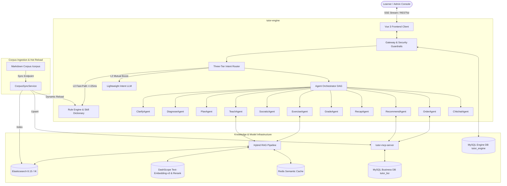

<div align="center">

# 🎓 Zhitu-AI
### Enterprise Multi-Agent Collaborative AI Tutoring & Guided Learning System

[](LICENSE)
[](https://spring.io/projects/spring-boot)
[](https://spring.io/projects/spring-ai)
[](https://vuejs.org/)
[](https://www.elastic.co/)
[](docs/test-report.md)

[English](./README_EN.md) · [简体中文](./README.md) · [Quick Start](#-quick-start) · [Architecture](#-system-architecture) · [Key Features](#-key-features)

</div>

---

## 🌟 Overview

**Zhitu-AI** is an industrial-grade, multi-agent AI tutoring and educational platform engineered for computer science and career-transitioning developers.
Unlike standard single-prompt chatbot wrappers, Zhitu-AI implements an **Orchestration Hub + 11 Specialized Business Agents** topology, establishing a seamless full-lifecycle educational loop:
**Diagnosis $\rightarrow$ Curriculum Planning $\rightarrow$ Socratic Guidance $\rightarrow$ Sealed Exercise Generation $\rightarrow$ Intelligent Grading $\rightarrow$ Multi-Turn Recap**.

Zhitu-AI introduces a novel **Corpus-Driven Zero-Code Course Extension Mechanism**—adding an entire new subject/curriculum requires **0 lines of Java or Vue code changes**. Simply drop pure Markdown course and question bank files into the repository, and the system hot-reloads dynamic alias dictionaries, ElasticSearch embeddings, and business catalog records automatically.

---

## 🚀 Key Features

### 1. 🤖 Central Orchestrator & 11 Specialized Agents
- **Three-Tier Intent Routing Network**:
  - **L0 Rule Fast-Path**: High-confidence, zero-ambiguity requests (e.g. *"Generate 3 multi-threading multiple choice questions"*) bypass LLM calls with ultra-low latency ($\le 25\text{ms}$);
  - **L2 LLM Decision**: Evaluates open-ended queries with multi-turn slot inheritance and controlled skill dictionary constraints, yielding **$98.2\%$** intent accuracy;
  - **Negative & Discussion Veto**: Disambiguates inquiry/discussion from exercise requests, preventing state-machine misfires.
- **Single-Turn Joint Decision**: Single LLM invocation simultaneously outputs intent, 7-dimensional slots, and staging execution plans, reducing network RTT and token overhead by over 60%.
- **DAG Parallel Execution & Critic Verification**: Manages educational state machine transitions and applies self-reflection quality checks to eliminate hallucinations.

### 2. ⚡ Corpus-Driven Zero-Code Hot Reload
- **Markdown-Driven Ingestion**: Course syllabi and private question banks are defined purely in Markdown.
- **Dynamic Alias Controlled Dictionary**: Frontmatter aliases (e.g., `golang` $\rightarrow$ `Go Concurrency in Action`) are extracted into `SkillDictionary` using concurrent memory hashes for zero-downtime hot reloads.
- **Full-Pipeline Adaptation**: Immediately activates recommendation, RAG instruction, quiz assembly, commerce checkout, and specialized recaps without recompilation.

### 3. 💡 Socratic Guidance & Anti-Cheat Protection
- **Heuristic Exploration**: Validates learner engineering intuition and prompts self-guided deduction of concurrency issues and version nuances (e.g., JDK 7 Segment Lock vs. JDK 8 CAS + Synchronized Bucket Lock).
- **Sealed Answer Keys**: Strips `answer` and `explanation` from exercise payload at the protocol level. Answers are encrypted and stored server-side, revealed only after student submission by the `GradeAgent`.
- **Dynamic Holistic Recap**: Synthesizes session cognitive mindmaps and highlights persistent knowledge gaps with TTFT under $1\text{s}$ ($903\text{ms}$).

### 4. 🔍 Enterprise Hybrid RAG Pipeline
- **Four-Stage Retrieval**: `Full-text BM25 + 1024-d Dense Vector + RRF (Reciprocal Rank Fusion) + Cross-Encoder Reranking (GTE-Rerank)`, achieving Recall@5 of **$96.0\%$**.
- **Multi-Format Document Parsing**: Web drag-and-drop parsing for Word (`.docx`), PDF (`.pdf`), and Markdown with breadcrumb context injection.
- **Conflict & Pre-Ingestion Alert**: Detects semantic collisions and warns operators of contradictory policies before committing to the corpus.
- **Semantic Cache**: Delivers sub-80ms responses on frequent identical queries via Redis.

### 5. 🛡️ Adversarial Defense & High Availability
- **100% Defense Against Adversarial Probes**: 40 red-team attack vectors (Prompt Injection, Jailbreak, System Prompt Sniffing, Unauthorized Tool Calling, Academic Dishonesty) validated and blocked at **$100\%$**.
- **Resilience4j Circuit Breakers**: Automatically downgrades gracefully on model timeout with zero frontend white-screen stalls.
- **Circuit-Break to Human Agent (`HUMAN_HANDOFF`)**: Triggers an automated customer service ticket after 3 consecutive failures.
- **Full-Stack APM Observability**: Tracks Trace/Span latencies, token consumption, and dollar cost per turn.

---

## 🏗️ System Architecture



---

## ⚡ Quick Start

### 1. Prerequisites
- **JDK 17+** & **Maven 3.8+**
- **Node.js 18+** & **npm**
- **Docker** & **Docker Compose**

### 2. Clone & Configure
```bash
git clone https://github.com/your-username/zhitu-ai.git
cd zhitu-ai

# Copy environment template
cp .env.example .env
```
Add your API key (e.g., DeepSeek or DashScope) into `.env`:
```env
OPENAI_API_KEY=sk-xxxxxxx
EMBEDDING_API_KEY=sk-xxxxxxx
```

### 3. Launch Infrastructure (Docker)
```bash
cd docker
docker-compose up -d
```
> Automatically provisions **Elasticsearch 8.15.0** (with auto-installed IK analyzer), **MySQL 8.0** (with auto-executed schemas and seed records), and **Redis 7.0**.

### 4. Build & Launch Backend Services
```bash
# Build all backend modules from root aggregator
cd ..
mvn clean package -DskipTests

# Start MCP Business Simulator
java -jar mcp-server/target/*.jar

# Start Core AI Tutor Engine (in a new terminal)
java -jar backend/target/*.jar
```

### 5. Launch Frontend
```bash
cd frontend
npm install
npm run dev
```
Navigate to `http://localhost:5173` to experience the tutoring system.

---

## 📄 License

This project is licensed under the [Apache License 2.0](LICENSE). Free for commercial and non-commercial usage.
